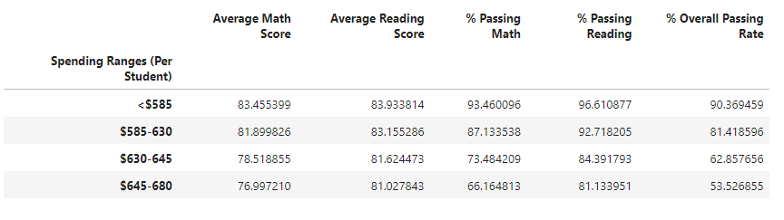
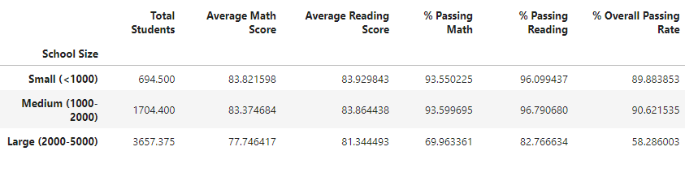
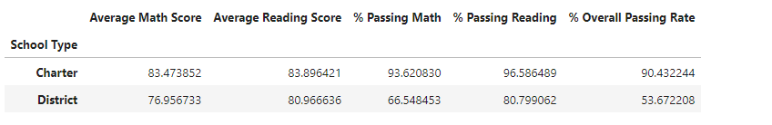

# School Data Analysis Using Pandas
This repo manipulates Pandas DataFrames to analyze school and standardized test data

## 🏫 Table of Contents
- [Background](#background)
- [Findings and Conclusions](#findings)
- [DataFrames](#part-1)

---
## 🏫 Background 
This project simulated the following situation:
You are the new Chief Data Scientist for your city's school district. In this capacity, you'll be helping the school board and mayor make strategic decisions regarding future school budgets and priorities.

As a first task, you've been asked to analyze the district-wide standardized test results. You'll be given access to every student's math and reading scores, as well as various information on the schools they attend. Your task is to aggregate the data to showcase obvious trends in school performance.

Using Pandas and Jupyter Notebook, create a report that includes the following data. Your report must include a written description of at least two observable trends based on the data.

---
## 🏫 Findings and Conclusions 
As a whole, charter schools out-performed the public district schools across all metrics. However, more analysis will be required to glean if the effect is due to school practices or the fact that charter schools tend to serve smaller student populations per school. A school_complete.csv and a students_complete.csv file were merged and analyzed. 

#### Conclusions from the calculations:
1.	The highest performing schools are the charter schools while the worst performing schools are the district school types. The overall passing rate of charter schools was 90% while the overall passing rate of district schools was 54%. From this information school type is a key factor in student success.
2.	The data supports the conclusion, a smaller student population is a key factor in achieving higher passing rates for students.  Charter schools have fewer total students compared to district schools. This contributes to a higher success rate. 
3.	Schools with a higher budget did not yield better test results. By contrast, schools with higher spending 645-680 per student actually underperformed compared to schools with smaller budgets (585 per student).

---
## 🏫 DataFrames 
#### Scores by School Spending

As a whole, schools with higher budgets, did not yield better test results. By contrast, schools with higher spending 645-680 per student actually underperformed compared to schools with smaller budgets (585 per student).

#### Scores by School Size

As a whole, smaller and medium sized schools dramatically out-performed large sized schools on passing math performances (89-91% passing vs 58%).

#### Scores by School Type

As a whole, charter schools out-performed the public district schools across all metrics. However, more analysis will be required to glean if the effect is due to school practices or the fact that charter schools tend to serve smaller student populations per school.
